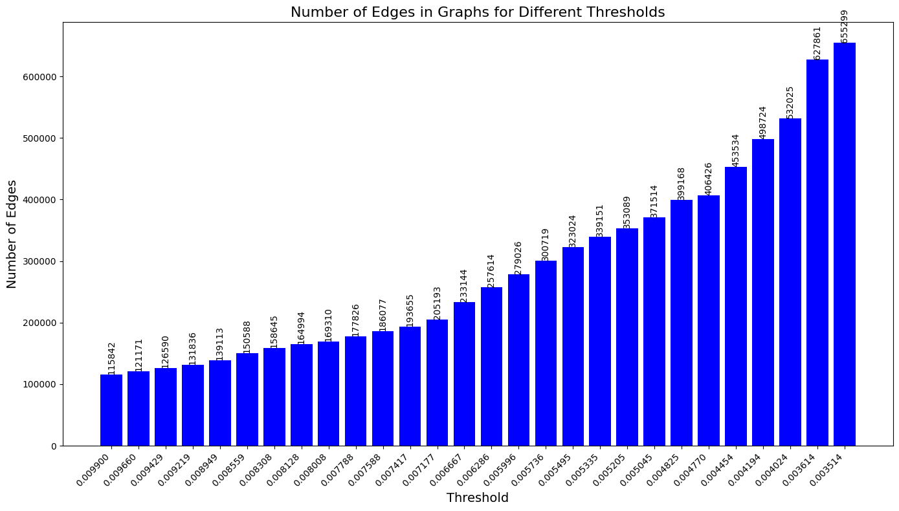

#  The Rhythm of Conversation: Content-Agnostic Community Classification using Meta-Graph Representations of Conversational Dynamics

This research investigates the potential of structure-only approaches for classifying communities in online social networks, leveraging graph abstraction techniques that intentionally exclude content or semantics. Instead, we explore how the rhythm and flow of conversation alone — encoded through interaction patterns — can reveal the nature of digital communities.

Note: This work is part of an ongoing research paper.

## Data
The raw Reddit JSON data is structured like this.
- `id`: the post's unique identifier
- `post_user`: the post's author
- `post_time`: the time at which the post was created, in unix time
- `post_body`: the post's body
- `comments`: a list of comments on the post, where each comment is a dictionary with the following keys:
  - `id`: the comment's unique identifier
  - `user`: the comment's author
  - `time`: the time at which the comment was created, in unix time
  - `body`: the comment's body
  - `replies`: a list of replies to the comment, where each reply is a dictionary with the same keys as a comment

This was processed into a graph with the following rules:
- Every user is a node
- There is an edge between each comment owner to the post owner
- There is an edge between each reply owner to the comment owner.

These graphs will be referred to as `level-1` graphs.

List of topics/labels:
```
Animals and Pets
Art
Business, Economics, and Finance
Food and Drink
Funny
Gaming
Internet Culture and Memes
Learning and Education
Music
Place
Sports
Technology
Television
```

The raw dataset can be found [here](https://zenodo.org/records/13343578).

## Approaches

A novel meta-graph abstraction is introduced, wherein Level-1 interaction graphs are embedded and aggregated to construct a Level-2 graph — a network of networks.

Each node in the Level-2 graph corresponds to a Level-1 graph (i.e., subreddit conversation), and edges are drawn between nodes with structural similarity above a threshold. This allows for high-level reasoning across communities based solely on conversation dynamics.


### Graph Embeddings 
Using [Graph2Vec](https://karateclub.readthedocs.io/en/latest/_modules/karateclub/graph_embedding/graph2vec.html), each Level-1 graph is embedded into a 128-dimensional vector space. Graph2Vec relies on the Weisfeiler-Lehman subtree kernel to capture local and global structural features effectively.

To build the Level-2 graph, cosine similarity scores between graph embeddings are calculated. Thresholds are selected from the 5th to 60th percentile of the similarity distribution, capturing the most informative relationships.


The GNN architecture and results are given below.


|  |  |
|----------------------------------------|--------------------------------------------|

Graph-level embeddings were fed into a GNN-based architecture trained to classify subreddits solely from structural signals. Cross-validation yielded an average test accuracy of ~83% across 13 labels. Approximately 200 graphs per class were used

Additionally, we also experimented with clustering techniques, which yielded poor results.

### Overlapping and Non-Overlapping Community Detection

To further probe structural similarities, pairwise Weisfeiler-Lehman isomorphism scores were used instead of embeddings. Key inflection points were extracted using Kernel Density Estimation (KDE), offering a principled alternative to percentile-based thresholds.

|  |  |
|----------------------------------------|--------------------------------------------|

Level 2 graph building algorithm:
```
Initialize an empty dictionary `graphs`

For each `threshold` in `inflection_points`:
    Initialize an empty graph `G`

    # Add nodes to the graph
    For each `graph` in `level_1_graphs`:
        Add `graph` as a node to `G`

    # Add edges based on similarity matrix and threshold
    For `i` from 0 to (number of rows in similarity_matrix - 1):
        For `j` from (i + 1) to (number of columns in similarity_matrix):
            If `similarity_matrix[i][j]` > `threshold`:
                Add an edge between nodes `level_1_graphs[i]` and `level_1_graphs[j]`
                Assign weight = `similarity_matrix[i][j]`

    Store graph `G` in `graphs`
```

These thresholds informed the construction of multiple Level-2 graphs for both overlapping and non-overlapping community detection experiments. A weighted contribution model was adopted for overlapping assignments.

|  |  |
|--------------------------------|--------------------------------|

The results are provided below.


## Algorithm Performance Table

| Algorithm             | Threshold | Homogeneity | Modularity | Accuracy (GNN) | F1   | NMI   | ARI   |
|-----------------------|-----------|-------------|------------|----------------|------|-------|-------|
| Louvain               | 0.0089    | 0.73        | 0.50       | N/A            | 0.46 | 0.48  | 0.34  |
| Label Propagation     | 0.0098    | 0.87        | 0.13       | N/A            | 0.22 | 0.27  | 0.05  |
| Fast Greedy           | 0.0098    | 0.80        | 0.42       | N/A            | 0.19 | 0.37  | 0.24  |
| Leading Eigenvector   | 0.0092    | 0.71        | 0.41       | N/A            | 0.32 | 0.36  | 0.20  |
| Walktrap              | 0.0096    | 0.89        | 0.40       | N/A            | 0.68 | 0.50  | 0.26  |
| Infomap               | 0.0096    | 0.85        | 0.47       | N/A            | 0.70 | 0.51  | 0.22  |
| Multilevel            | 0.0096    | 0.77        | 0.49       | N/A            | 0.37 | 0.48  | 0.34  |
| leiden                | 0.0094    | 0.74        | 0.50       | N/A            | 0.46 | 0.47  | 0.32  |
| SLPA                  | 0.0077    | 0.86        | 0.51       | N/A            | 0.50 | 0.64  | 0.44  |
| Angel                 | 0.0094    | 0.69        | -0.01      | N/A            | 0.56 | 0.41  | 0.02  |
| Demon                 | 0.0098    | 0.65        | 0.06       | N/A            | 0.61 | 0.39  | 0.05  |
| Core Expansion        | 0.0092    | 0.69        | 0.05       | N/A            | 0.68 | 0.39  | 0.03  |

| Algorithm             | Threshold | Homogeneity | Sihoutte Score | Accuracy (GNN) | F1   | NMI   | ARI   |
|-----------------------|-----------|-------------|----------------|----------------|------|-------|-------|
| GraphSAGE Mean        | 0.11      | 0.81        | N/A            | 0.83           | 0.83 | 0.81  | 0.71  |
| Kmeans                | 13        | 0.15        | 0.33           | 0.07           | 0.24 | 0.15  | 0.05  |
| DBSCAN                | 13        | 0.007       | 0.34           | 0.01           | 0.08 | 0.01  | 0.0001|


## Cite
If you build upon or use our work in a scientific publication, please cite our paper.

```
@article{hahaweaintpublishedyet,
  author  = {Dayanand V, Arjhun Sreedar and Pranav Deepak},
  title   = {hahaweaintpublishedyet},
  journal = {Journal of hahaweaintpublishedyet},
  year    = {2025},
  volume  = {?},
  number  = {?},
  pages   = {?}
}
```
Preprint coming soon: https://hahaweaintpublishedyet.com/best-paper-of-2025

## Contributors
- [Dayanand V](mailto:v_dayanand@cb.amrita.edu)
- [Pranav Deepak](mailto:pranavdeepak13@gmail.com)
- [Arjhun Sreedar](mailto:contactarjhun@gmail.com)

