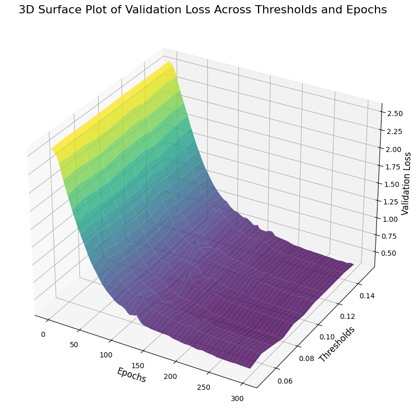
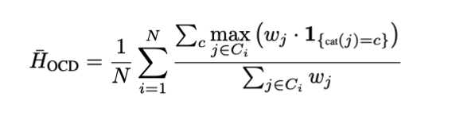
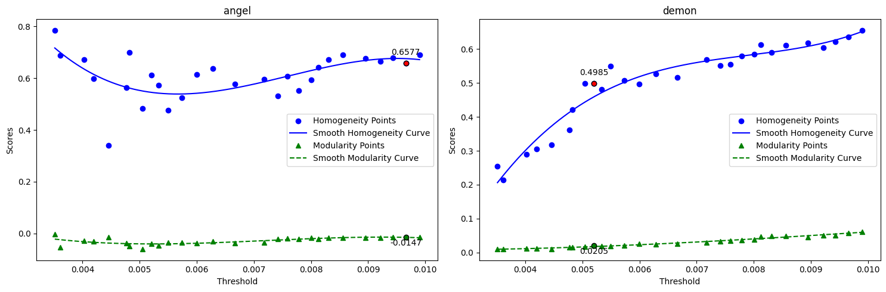

#  Supervised vs Unsupervised Learning Approaches to Topic Classification on Reddit Conversational Graphs

This project attempts to follow several (supervised & unsupervised) approaches towards topical classification on Reddit data that is modelled as a conversational graph. More on the data setup below. 

We strictly use *only* the network structure itself in our methods and have not leveraged the content for this study. 

**This project is part of a research paper that is still work-in-progress.**

## Data
The raw Reddit JSON data is structured like this.
- `id`: the post's unique identifier
- `post_user`: the post's author
- `post_time`: the time at which the post was created, in unix time
- `post_body`: the post's body
- `post_polarity`: the post's polarity, as a number between -1 and 1
- `post_sentiment`: the post's sentiment, 0 for neutral, 1 for positive, -1 for negative
- `comments`: a list of comments on the post, where each comment is a dictionary with the following keys:
  - `id`: the comment's unique identifier
  - `user`: the comment's author
  - `time`: the time at which the comment was created, in unix time
  - `body`: the comment's body
  - `comment_polarity`: the comment's polarity, as a number between -1 and 1
  - `comment_sentiment`: the comment's sentiment, 0 for neutral, 1 for positive, -1 for negative
  - `replies`: a list of replies to the comment, where each reply is a dictionary with the same keys as a comment

This was processed into a graph with the following rules:
- Every user is a node
- There is an edge between each comment owner to the post owner
- There is an edge between each reply owner to the comment owner.
- Edge weight representing the normalized sentiment score of all interactions between the two users in a specific direction. (This was done initially but the sentiment scores as such was not used in any of the research paths we followed).

These graphs will be referred to as `Level 1` graphs.

The raw dataset can be found [here](https://zenodo.org/records/13343578).

## Approaches

Both supervised and unsupervised techniques were explored. 

### Supervised
We trained a Graph Neural Network (GNN) to classify `Level 1` graphs, but due to the large graph sizes, we used [Graph2Vec](https://karateclub.readthedocs.io/en/latest/_modules/karateclub/graph_embedding/graph2vec.html) to embed these into 128-dimensional vectors. Graph2Vec leverages Weisfeiler-Lehman subtree kernels to capture structural features, which are then encoded into fixed-size embeddings. While this method simplifies computations, it may lose granular structural details.

Using the resulting embeddings, we created `Level 2` graphs where nodes represent Level 1 graphs, and edges connect nodes with cosine similarity scores above a chosen threshold. Threshold selection was critical and involved cross-validation to balance connectivity and sparsity.


The GNN architecture and results are given below.


|  |  |
|----------------------------------------|--------------------------------------------|

Through cross-validation, we were able to achieve an `~84%` average test accuracy across folds, for `~200` graphs per label for a total of `13` labels.

We believe that, for a larger dataset, it should be possible to achieve better results.


### Unsupervised

#### Community and Overlapping Community Detection.
Since we had the `Level 2` graphs generated for different thresholds above, we tried to use them to use natural clustering algorithms, however, the threshold selection process did not turn up to as easy as the supervised example. We resorted to using KDE (Kernel Density Estimate), which was helpful for identifying potential thresholds as it smooths out the randomness in the distribution and highlights underlying patterns. Through KDE, we can locate potential inflection points.

|  |  |
|----------------------------------------|--------------------------------------------|

Once we had the thresholds, we built the new `Level 2` graphs.

```
Initialize an empty dictionary `graphs`

For each `threshold` in `inflection_points`:
    Initialize an empty graph `G`

    # Add nodes to the graph
    For each `graph` in `list_of_files`:
        Add `graph` as a node to `G`
        Assign attributes:
            topic = (optional topic value, can be skipped)
            subreddit = (optional subreddit value, can be skipped)

    # Add edges based on similarity matrix and threshold
    For `i` from 0 to (number of rows in similarity_matrix - 1):
        For `j` from (i + 1) to (number of columns in similarity_matrix):
            If `similarity_matrix[i][j]` > `threshold`:
                Add an edge between nodes `list_of_files[i]` and `list_of_files[j]`
                Assign weight = `similarity_matrix[i][j]`

    Store graph `G` in `graphs`
```

Once we have the graphs, we ran both community and overlapping community detection algorithms. 

Since we cannot really control the number of clusters returned, we decided to take a more democratised approach to validating the results in this case.

We used homogeneity, which takes into account the MCC (most common category) in any given community and calculates the **homogeneity** of that community. 

|  |  |
|--------------------------------|--------------------------------|

When it comes to Overlapping communities, we weight the contribution based on how many communities a given node has been assigned. 

The results are provided below.
|  |  |
|--------------------------------------|--------------------------------------|
|  |  |
|  |  |


#### Clustering
TBD

### What do these results mean? 
TBD

## Algorithm Performance Table

| Algorithm         | Threshold | Homogeneity | Modularity | Accuracy (GNN) | Clustering Metric (?) |
|--------------------|-----------|-------------|------------|----------------|-----------------------|
| Louvain           | 0.00921   | 0.7920      | 0.4935     | N/A            | N/A                   |
| Girvan Newman     | 0.0059    | 1.0         | 0.0002     | N/A            | N/A                   |
| Label Propagation | 0.004     | 1.0         | 0.0006     | N/A            | N/A                   |
| Fast Greedy       | 0.0071    | 0.9091      | 0.3506     | N/A            | N/A                   |
| Leading Eigenvector | 0.0075  | 0.7648      | 0.3669     | N/A            | N/A                   |
| Walktrap          | 0.0096    | 0.9053      | 0.4060     | N/A            | N/A                   |
| SLPA              | 0.00385   | 0.78        | 0.2393     | N/A            | N/A                   |
| MultiCOM          | 0.0065    | 0.76        | 0.1099     | N/A            | N/A                   |
| Angel             | 0.0098    | 0.75        | 0.0777     | N/A            | N/A                   |
| Demon             | 0.0095    | 0.726       | 0.2704     | N/A            | N/A                   |
| Core Expansion    | 0.0092    | 0.69        | 0.3045     | N/A            | N/A                   |
| Graph Entropy     | 0.0089    | 0.69        | 0.0639     | N/A            | N/A                   |
| GNN               | 0.11      | N/A         | N/A        | 84% (average)  | N/A                   |
| Clustering        | TBD       | TBD         | TBD        | N/A            | TBD                   |


## Conclusion

This study demonstrates that even unsupervised techniques, such as community and overlapping community detection, can provide a good approximation of which structures belong together based on similarity. However, there are notable challenges:  
1. Threshold identification for Level 2 graph generation. 
2. Level 1 graph data collection.
3. Computational limitations to processing Level 1 graphs.

## Future Work

1. Include **content embeddings** (e.g., from posts and comments) to complement the network structure for better classification results.  
2. Scale the study by experimenting with a significantly **larger number of graphs**.  
3. Investigate alternative techniques for threshold selection, including adaptive thresholds or dynamic methods based on graph properties.

## Contributors
- Dayanand V
- Pranav Deepak
- Arjhun Sreedar

